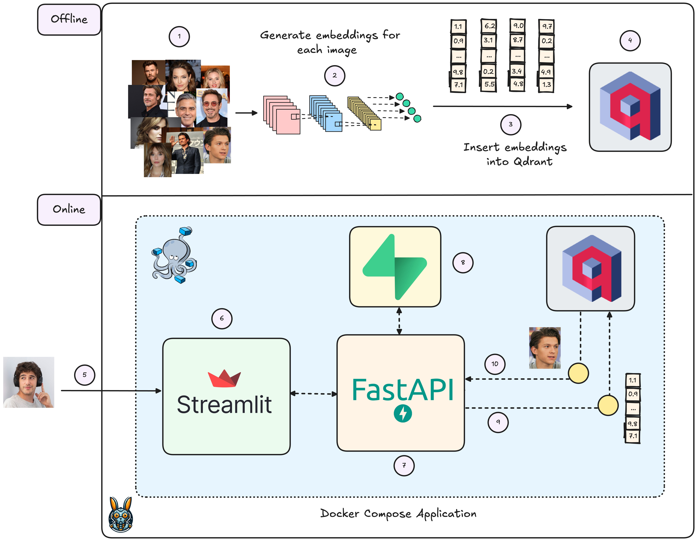
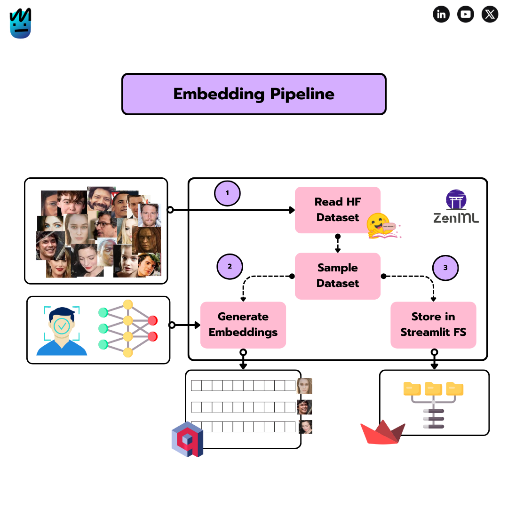
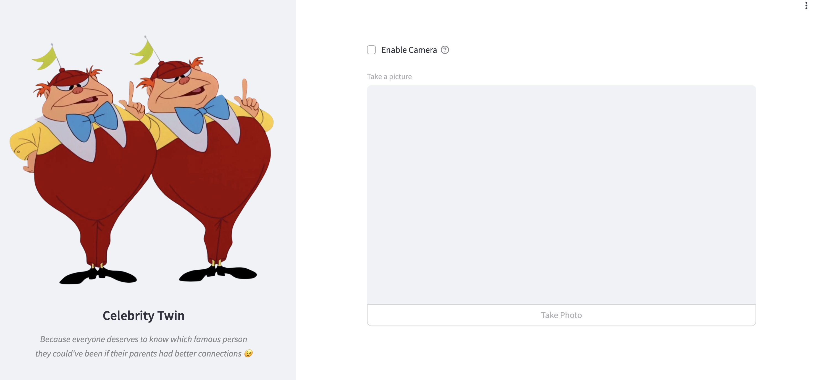
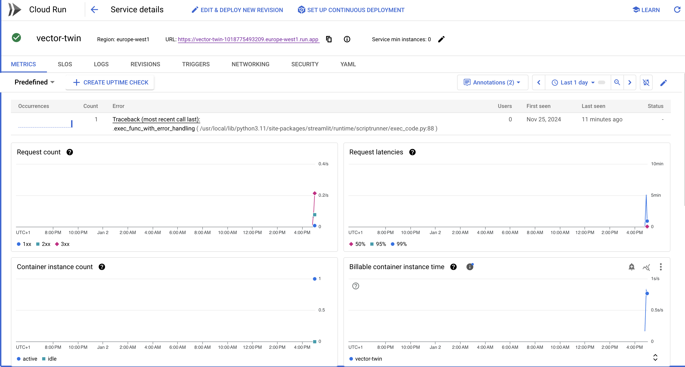

<p align="center">
        
    <h1 align="center">Twin Celebrity App</h1>
    <h3 align="center">Find your Twin Celebrity in Vector Space
</h3>
</p>

>  Because everyone deserves to know which famous person they could've been if their parents had better connections 😉


## Table of Contents

- [1. Introduction](#introduction)
- [2. Project Design](#project-design)
    - [2.1 Embedding Generation Pipeline](#embedding-generation-pipeline)
    - [2.2 Streamlit UI](#streamlit-ui)
    - [2.3 Vector Twin Package](#vector-twin-package)

- [3. Prerequisites](#prerequisites)
- [4. Installation](#installation)
- [5. Configuration](#configuration)
- [6. Running the project locally](#running-the-project-locally)
- [7. Running the project with cloud deployment](#running-the-project-with-cloud-deployment)
- [8. License](#license)
- [9. Contributing](#contributing)


## Introduction

Twin Celebrity App is a machine learning project that uses face embeddings and vector similarity search to find celebrity lookalikes. The project combines the following technologies:

- [FaceNet](https://github.com/timesler/facenet-pytorch) embeddings for the celebrities faces
- [Qdrant](https://qdrant.tech/) for vector similarity search
- [ZenML](https://www.zenml.io/) for pipeline orchestration
- [Streamlit](https://streamlit.io/) for the user interface
- [Google Cloud Run](https://cloud.google.com/run) for deployment (optional)

In case you want to see the project in action, you can check out the following YouTube video:

<div align="center">
  <a href="https://youtu.be/LltFAum3gVg?si=lJmdCqf1MDNJl01r">
    
  </a>
</div>

## Project Design 

The project is built around the following components:

### Embedding Generation Pipeline

<p align="center">

</p>

> Check out the ZenML pipeline [here](src/embedding_pipeline/pipeline.py)!

The embedding generation pipeline is responsible for extracting face embeddings from the celebrities images. It uses the FaceNet architecture to generate the embeddings and stores them in a Qdrant vector database. The pipeline is orchestrated using ZenML.

The ZenML pipeline is configured to use either a local Qdrant instance or a Qdrant Cloud instance, depending on the `use_qdrant_cloud` flag. It's composed of the following steps: 

   - **Load the dataset**: The dataset is loaded from a Hugging Face dataset.

   - **Sample the dataset**: The dataset is sampled to reduce the number of embeddings to process.

   - **Generate the embeddings**: The embeddings are generated using the FaceNet architecture.

   - **Store the embeddings**: The embeddings are stored in a Qdrant vector database.

   - **Store images in local filesystem**: The images are stored in your local filesystem for later use in the Streamlit application (after dockerizing the app).

### Streamlit UI

<p align="center">

</p>

> Check out the Streamlit UI [here](src/app/main.py)!

The Streamlit UI is the user interface of the application. It allows you to upload an image, search for the closest celebrity lookalike and display the results. The cool thing about this UI is that you'll learn how to use your webcam as the input!

### Vector Twin Package

> Check out the vector_twin package [here](src/vector_twin/)!

The vector_twin package contains all the logic for the embedding generation pipeline and the vector search system. You'll also see some scripts to help you manage ZenML secrets generation and deployment.


## Prerequisites 

- Python 3.11 or higher
- Poetry for dependency management
- Docker 
- ZenML
- Qdrant Cloud account for cloud deployment
- Google Cloud account for deployment

## Installation

1. Clone the repository:

```bash
git clone https://github.com/yourusername/vector-twin.git
cd vector-twin
```

2. Install dependencies using Poetry:

```bash
poetry install
```

3. Activate the virtual environment:

```bash
poetry shell
```

## Configuration

### Environment Variables

Create a `.env` file in the project root with the following variables:

```bash
QDRANT_URL=your-qdrant-cloud-url
QDRANT_API_KEY=your-qdrant-cloud-api-key
```

You can use the `.env.example` file as a template. Simply copy it to `.env` and fill in the values.


### ZenML Setup

First of all, you'll need to login to ZenML cloud and create a new tenant. After that, you can initialize he ZenML CLI and set up the default stack - that's basically what is happening in the `configure-zenml` command.
```bash
make configure-zenml
```

### Running the project locally

To run the project locally, you'll need to start the local Qdrant instance and run the embedding pipeline. You can do this with the following command:

```bash
make start-local-app
```

This will start the local Qdrant instance and run the embedding pipeline. Then, it will also creat the Streamlit UI. You can then access the application by navigating to the `http://localhost:8501` URL in your web browser.


### Running the project with cloud deployment

To run the project with cloud deployment, you'll need to create a [Qdrant Cloud cluster](https://cloud.qdrant.io/login) (free!) and add the credentials to your `.env` file. Take the `.env.example` file as a template for your `.env` file.

Once you have your QDRANT_URL and QDRANT_API_KEY set, you can run the following command:

```bash
make insert-embeddings-qdrant-cloud
``` 

This command will run the ZenML pipeline and insert the embeddings into your Qdrant Cloud cluster. Once the embeddings are inserted, you cann check the vectors are populating your Qdrant Cloud cluster by navigating to Qdrant's UI.

To deploy the Streamlit app, we'll use Google Cloud Run. This will allow us to deploy the app in a fully managed way, but it will also require a Google Cloud Account and the [Google Cloud CLI](https://cloud.google.com/sdk/docs/install) installed.

1. Authenticate with Google Cloud:

```bash
gcloud auth login
```

2. Set your Google Cloud project:

```bash
gcloud config set project <PROJECT_ID>
``` 

3. Add the necessary permissions:

```bash
gcloud services enable cloudbuild.googleapis.com
gcloud services enable run.googleapis.com
gcloud services enable artifactregistry.googleapis.com
gcloud services enable cloudresourcemanager.googleapis.com
gcloud services enable secretmanager.googleapis.com
```

4. Auth docker registry:

```bash
gcloud config set compute/region <LOCATION>
gcloud auth configure-docker <LOCATION>-docker.pkg.dev -q 
```

Location is the region where you want your project to be deployed. In my case, I'm using 'europe-west1'.

5. Create the Docker repository:

```bash
gcloud artifacts repositories create vector-twin-app --repository-format=docker \
    --location=<LOCATION> --description="Docker repository for the Twin Celebrity App" \
    --project=<PROJECT_ID>
```

6. Create secrets for Cloud Run:

```bash
echo -n <QDRANT_URL> | gcloud secrets create QDRANT_URL \
    --replication-policy="automatic" \
    --data-file=-
    
echo -n <QDRANT_API_KEY> | gcloud secrets create QDRANT_API_KEY \
    --replication-policy="automatic" \
    --data-file=-
```

7. Add Cloud Run permissions to secrets:

```bash
gcloud projects add-iam-policy-binding vector-twin \
  --member="serviceAccount:$(gcloud projects describe $(gcloud config get-value project) --format="value(projectNumber)")-compute@developer.gserviceaccount.com" \
  --role="roles/secretmanager.secretAccessor"
```

8. Finally, let's build the Cloud Run application:

```bash

gcloud run deploy vector-twin \
    --port=8501 \
    --image=<LOCATION>-docker.pkg.dev/<PROJECT_ID>/vector-twin-app/app \
    --allow-unauthenticated \
    --region=<LOCATION> \
    --platform=managed \
    --project=<PROJECT_ID> \
    --memory=2Gi \
    --update-secrets=QDRANT_API_KEY=QDRANT_API_KEY:latest,QDRANT_URL=QDRANT_URL:latest
```

9. (Bonus) cloudbuild.yaml file:

I've also created a cloudbuild.yaml file to automate the deployment process. You can find it in the root of the project. To run it, you can use the following command:

```bash
gcloud builds submit --region=<LOCATION>
```

And that's it! You can now access the application by navigating to your Google Cloud Project and clicking on the Cloud Run service.

<p align="center">

</p>

## License

This project is licensed under the MIT License - see the LICENSE file for details.

## Contributing

1. Fork the repository
2. Create a feature branch
3. Commit your changes
4. Push to the branch
5. Create a Pull Request
